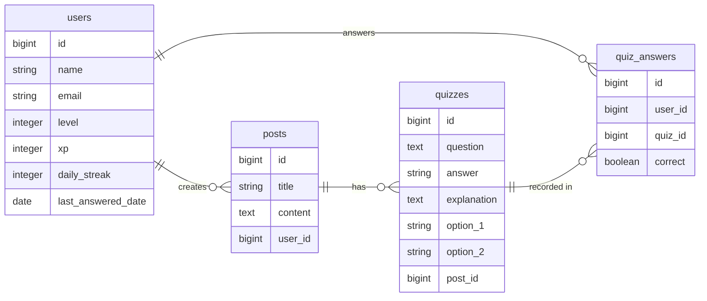

# Code Understanding Quiz

## アプリの概要

### **AIがあなたが投稿したコードからクイズを自動作成し、理解度を楽しく深めることができる学習プラットフォームです。**

自身の書いたプログラムや学習中のコードを投稿するだけで、AIがそのコードから最適な三択クイズを作成。回答を繰り返すことで、コードのロジックや仕様への深い理解をサポートします。

## アプリのスクリーンショット & デモ

  

### 【デモ動画：クイズ生成の様子】

  <video src="" width="60%" controls></video>

## アプリの使い方

1. **ログイン/ゲストログイン**: アカウントを作成するか、ワンクリックで体験できるゲストログインを利用します。
2. **コードの投稿**: 理解を深めたいコードをタイトルと共に投稿します。
3. **クイズ生成**: 投稿詳細画面から「AIで新しいクイズを作る」ボタンをクリック。AIがコードを解析し、問題を作成します。
4. **回答・学習**: 作成されたクイズに回答。正解すると経験値(XP)が獲得でき、レベルアップの要素も楽しめます。
5. **復習**: 蓄積された過去のクイズや、公式ドリルにいつでも挑戦して知識を定着させることができます。

## 開発のきっかけ

AIに指示を出せば、まるで魔法のように完成されたコードが返ってきます。しかし、プログラムが正常に動いていても、心のどこかで「本当はよく分かっていないのではないか」という強い焦りを感じることがありました。

AIが何でもやってくれる今だからこそ、ただ動くだけで満足せず、自分自身ももっとプログラミングを深く理解して、成長していきたい。

そんな思いから、このアプリを作成しました。

## コンセプト

このアプリは、既に用意されたクイズではなく、「自分がAIに指示して作ってもらったコード」を題材に、その中身をどれだけ理解できているかを確認するためのトレーニングツールです。

クイズ形式でコードの内容について問われることで、つい読み飛ばしてしまいがちなコードをじっくり読み解くきっかけを作ります。なんとなくの「分かったつもり」を卒業して、楽しみながら理解を深めていくことを目指しています。

## 工夫したところ（技術的なこだわり）

- **AIプロンプトの最適化**: 回答の選択肢が紛らわしくなりすぎず、かつ本質を突いたものになるよう、システムプロンプトの調整を繰り返しました。
  
- **自分にぴったりの難易度**: AIが今の自分のレベルに合わせて問題を調整してくれるので、無理なく一歩ずつ進めます。
  
- **ゲーミフィケーション**: ストリーク機能（継続日数）やコンボボーナス、経験値(XP)によるレベル上げ・称号システムを導入し、学習を継続したくなる仕組みを構築しました。
    
- **テスト自動化と品質管理**: UIの整合性を保つシステムテストを導入し、機能要件を網羅的に検証することで、プログラムの動作仕様が常に担保される安定した開発環境を整えました。

## ER図

## 技術スタック

- **Backend**: Ruby 3.2.x / Ruby on Rails 7.1.x
- **Frontend**: Tailwind CSS / Hotwire (Turbo / Stimulus)
- **Database**: PostgreSQL
- **AI**: Gemini API
- **Infrastructure**: Render
- **Testing**: RSpec / Selenium (System Spec)
- **Linter**: RuboCop

## 今後の展望（追加予定の機能）

より深い学習体験を提供するために、以下の機能の追加を検討しています。

- **AIとの対話型QA**: クイズの解説を読んでも解決しない疑問を、その場でAIに直接質問できる機能
- **GitHub連携**: 自分のリポジトリにあるコードを直接読み込み、開発ログに基づいた実戦的なクイズを作成
- **パーソナライズ・ロードマップ**: 過去の回答データをAIが分析し、苦手な構文やロジックを重点的に学べるカリキュラムを自動生成
- **多言語プロンプトの高度化**: フレームワークやライブラリ特有の仕様に特化したより深いクイズ生成

